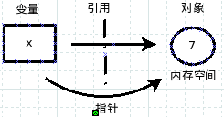

## 变量、对象和引用

1.变量

**变量创建**

> 一个变量（也就是变量名），就想a，当代码第一次给他赋值是就创建了它。之后的赋值也会改变自己创建的变量名的值。从技术上来讲，Python在代码运行之前先检测变量名，可以当成是最初的赋值创建变量。

**变量类型**

> 变量永远不会有任何的和它关联的类型信息或约束。类型的概念是存在与对象中而不是变量名中。变量原本是通用的，它只是在一个特定的时间点，简单地引用了一个特定的对象而已。

**变量使用**

> 当变量出现在表达式中时，它会马上被当前引用的对象所代替，无论这个对象时什么类型。此外，所有的变量必须在其使用前明确地赋值，使用未赋值的变量会产生错误。

对于
<pre>a = 3</pre>
Python会执行下面三个步骤：

1. 创建一个对象来代表值3。
2. 创建一个变量a，如果它还没有被创建的话。
3. 将变量与新的对象相连接。

如图

### 参考

[Python学习手册](https://www.baidu.com/s?wd=Python%E5%AD%A6%E4%B9%A0%E6%89%8B%E5%86%8C&rsv_spt=1&rsv_iqid=0xb3a048c900038a73&issp=1&f=8&rsv_bp=0&rsv_idx=2&ie=utf-8&tn=baiduhome_pg&rsv_enter=1&rsv_sug3=19&rsv_sug1=16&rsv_sug7=100&rsv_sug2=0&inputT=6601&rsv_sug4=6612 "Python学习手册")

[跟老齐学Python之深入变量和引用对象](http://www.jb51.net/article/55576.htm "跟老齐学Python之深入变量和引用对象")