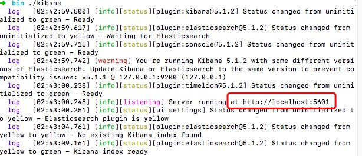
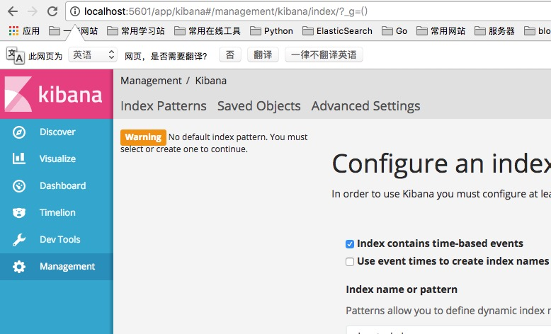
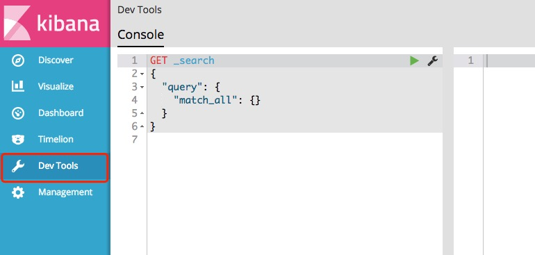
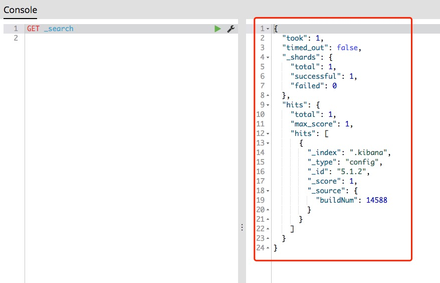

# Elasticsearch基础环境搭建

## 1.Elasticsearch介绍

### 1.1 Elasticsearch - Wikipedia

译自[Elasticsearch - 维基百科](https://en.wikipedia.org/wiki/Elasticsearch)：

Elasticsearch是基于Lucene的搜索引擎。它提供了一个分布式、多租户可全文搜索引擎通过HTTP Web界面和无模式JSON文件。Elasticsearch java开发的，作为Apache许可证条款下的开源发布。官方客户端的java，是可用的。NET（C #），PHP，Python，Apache的Groovy和许多其他语言。Elasticsearch是最受欢迎的企业搜索引擎，其次是Apache Solr，也基于Lucene。

Elasticsearch是一起开发数据采集和日志分析引擎叫Logstash，以及分析和可视化平台“Kibana。这三种产品被设计成作为一个集成解决方案使用，称为“弹性堆栈”（以前是“ELK 堆”）。

### 1.2 我们搭建一个网站或者程序，希望添加搜索功能，发现搜索工作很难：

1. 我们希望搜索解决方案要高效
2. 我们希望零配置和完全免费的搜索方案
3. 我们希望能够简单的通过json和http与搜索引擎交互
4. 我们希望我们的搜索服务器稳定
5. 我们希望能够简单的将一台服务器扩展到上百台

## 2.Elasticsearch安装

1. 安装elasticsearch-rtf
2. head插件
3. kibana的安装

---

### 2.1 安装 jdk
自行 [百度](https://www.baidu.com/) / [谷歌](https://www.google.com)。

### 2.2 安装 elasticsearch-rtf

前言：什么是Elasticsearch-RTF？ RTF是Ready To Fly的缩写，在航模里面，表示无需自己组装零件即可直接上手即飞的航空模型，Elasticsearch-RTF是针对中文的一个发行版，即使用最新稳定的elasticsearch版本，并且帮你下载测试好对应的插件，如中文分词插件等，目的是让你可以下载下来就可以直接的使用（虽然es已经很简单了，但是很多新手还是需要去花时间去找配置，中间的过程其实很痛苦），当然等你对这些都熟悉了之后，你完全可以自己去diy了，跟linux的众多发行版是一个意思。

引自：[https://github.com/medcl/elasticsearch-rtf](https://github.com/medcl/elasticsearch-rtf)

---

1. 从[Github](https://github.com)下载：[elasticsearch-rtf](https://github.com/medcl/elasticsearch-rtf)
2. 解压
3. 运行，切换到```bin```目录下
	- ***Windows***下运行```elasticsearch.bat```
	- ***Mac/Linux***下运行```./elasticsearch```
	- 切记不要用***root***用户去运行，否则会报错，具体自行 [百度](https://www.baidu.com/) / [谷歌](https://www.google.com)
4. 效果:

	
5. 浏览器输入：```localhost:9200```
	
	 

 

### 2.3 安装 elasticsearch-head

1. 从[Github](https://github.com)下载：[elasticsearch-head](https://github.com/mobz/elasticsearch-head)
2. 解压
3. 安装cnpm：[安装npm及cnpm](https://www.cnblogs.com/yominhi/p/7039795.html)
4. Install：切换到 ```elasticsearch-head``` 目录下，运行```cnpm install```
5. 运行：直接 ```cpnm run start```
6. 效果:
	
	
7. ①.发现输入：从浏览器访问```localhost:9200```是没问题，但是***elasticsearch-head***就是连不上。
	
	
	
	②.浏览器输入：```localhost:9100```也显示确实未连接。
	
	
	***注：这是由于elasticsearch的安全策略，默认不允许使用第三方服务（版本5之前elasticsearch-head是属于elasticsearch 的，但现在是单独的服务了，所以为出现这种情况）***

8. 设置安全策略
<pre>
	http.cors.enabled: true
	http.cors.allow-origin: "*"
	http.cors.allow-methods: OPTIONS, HEAD, GET, POST, PUT, DELETE
	http.cors.allow-headers: "X-Requested-With, Content-Type, Content-Length, X-User"
</pre>

将以上内容复制到```config/elasticsearch.yaml```最后，然后重启```es```和```head```即可

### 2.4 安装 kibana

前言：Kibana是一个开放源代码的分析和可视化平台的设计与Elasticsearch。你用Kibana搜索，查看，并与存储在Elasticsearch指标数据进行交互。您可以轻松地执行高级数据分析，并在各种图表、表格和地图中可视化您的数据。

Kibana可以很容易理解大量数据。简单的，基于浏览器的界面，使您可以快速创建和共享的动态仪表盘显示变化到Elasticsearch实时查询。你可以在几分钟之内安装和开始探索你的Elasticsearch索引数据，不需要写任何代码，没有其他基础软件依赖

引自：[https://www.elastic.co/guide/en/kibana/master/introduction.html](https://www.elastic.co/guide/en/kibana/master/introduction.html)

---

1. kibana官网下载：[Kibana](https://www.elastic.co/downloads/kibana)，我用的是 [Kibana 5.1.2](https://www.elastic.co/downloads/past-releases/kibana-5-1-2)
2. 解压
3. 运行，切换到```bin```目录下
	- ***Windows***下运行```kibana ```
	- ***Mac/Linux***下运行```./kibana```
4. 效果:
	
	
5. 浏览器输入：```localhost:5601```
	
	 
6. 点击Dev Tools：
	
	

7. 接下来，请开始你的表演：
	
	 


