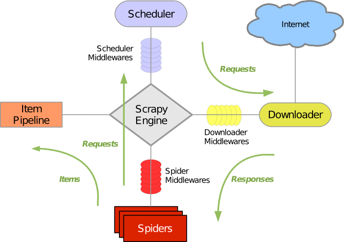

## Scrapy架构原理初探

### 1.Scrapy架构图

#### 1. Scrapy Engine（Scrapy引擎）
引擎负责控制数据流在系统中所有组件中流动，并在相应动作发生时触发事件。

#### 2. Scheduler（调度器）
调度器从引擎接受request并将他们入队，以便以后引擎请求他们时提供给引擎

#### 3.Downloader（下载器）
下载器负责获取页面数据并提供给引擎

#### 4.Spiders
Spider是Scrapy用户编写用于分析response并提取item（即获取到item）或额外跟进的URL的类。每个spider负责处理一个特定（或一些）网站。更多内容请看[Spider](http://scrapy-chs.readthedocs.io/zh_CN/latest/topics/spiders.html#topics-spiders)

#### 5.Item Pipeline
Item Pipeline负责处理被spider提取出来的item。典型的处理有清理、验证及持久化（例如存储到数据库中）。更多内容请看[Item Pipeline](http://scrapy-chs.readthedocs.io/zh_CN/latest/topics/item-pipeline.html#topics-item-pipeline)

#### 6.下载器中间件（Downloader middlewares）
下载器中间件是在引擎及下载器之间的特定钩子(specific hook)，处理Downloader传递给引擎的response。其提供了一个简单的机制，通过插入自定义代码来扩展Scrapy功能。更多内容请看[下载器中间件(Downloader middlewares)](http://scrapy-chs.readthedocs.io/zh_CN/latest/topics/downloader-middleware.html#topics-downloader-middleware)

#### 7.Spider中间件(Spider middlewares)
Spider中间件是在引擎及Spider之间的特定钩子(specific hook)，处理spider的输入(response)和输出(items及requests)。 其提供了一个简便的机制，通过插入自定义代码来扩展Scrapy功能。更多内容请看 [Spider中间件(Middleware)](http://scrapy-chs.readthedocs.io/zh_CN/latest/topics/spider-middleware.html#topics-spider-middleware) 。

> ### 2.来自[官方文档][guanfang-doc]的架构浏览

> 

> #### 数据流(Data flow)
> Scrapy中的数据流由执行引擎控制，其过程如下:
 
> 1. 引擎打开一个网站(open a domain)，找到处理该网站的Spider并向该spider请求第一个要爬取的URL(s)。
2. 引擎从Spider中获取到第一个要爬取的URL并在调度器(Scheduler)以Request调度。
3. 引擎向调度器请求下一个要爬取的URL。
4. 调度器返回下一个要爬取的URL给引擎，引擎将URL通过下载中间件(请求(request)方向)转发给下载器(Downloader)。
5. 一旦页面下载完毕，下载器生成一个该页面的Response，并将其通过下载中间件(返回(response)方向)发送给引擎。
6. 引擎从下载器中接收到Response并通过Spider中间件(输入方向)发送给Spider处理。
7. Spider处理Response并返回爬取到的Item及(跟进的)新的Request给引擎。
8. 引擎将(Spider返回的)爬取到的Item给Item Pipeline，将(Spider返回的)Request给调度器。
9. (从第二步)重复直到调度器中没有更多地request，引擎关闭该网站。

> #### 事件驱动网络(Event-driven networking)
Scrapy基于事件驱动网络框架 [Twisted](http://twistedmatrix.com/trac/) 编写。因此，Scrapy基于并发性考虑由非阻塞(即异步)的实现。

> <strong>关于异步编程及Twisted更多的内容请查看下列链接:</strong>

> [Introduction to Deferreds in Twisted](http://twistedmatrix.com/documents/current/core/howto/defer-intro.html)

> [Twisted - hello, asynchronous programming](http://jessenoller.com/2009/02/11/twisted-hello-asynchronous-programming/)

[guanfang-doc]:https://docs.scrapy.org/en/latest/topics/architecture.html