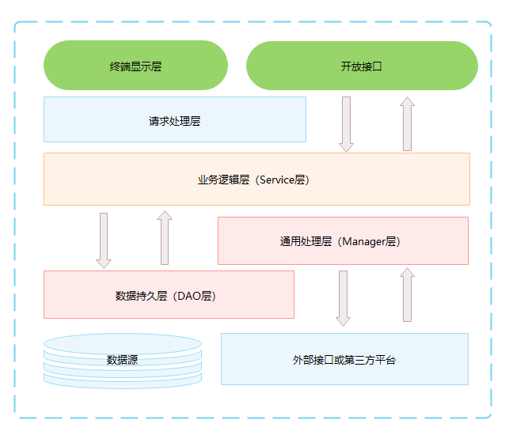
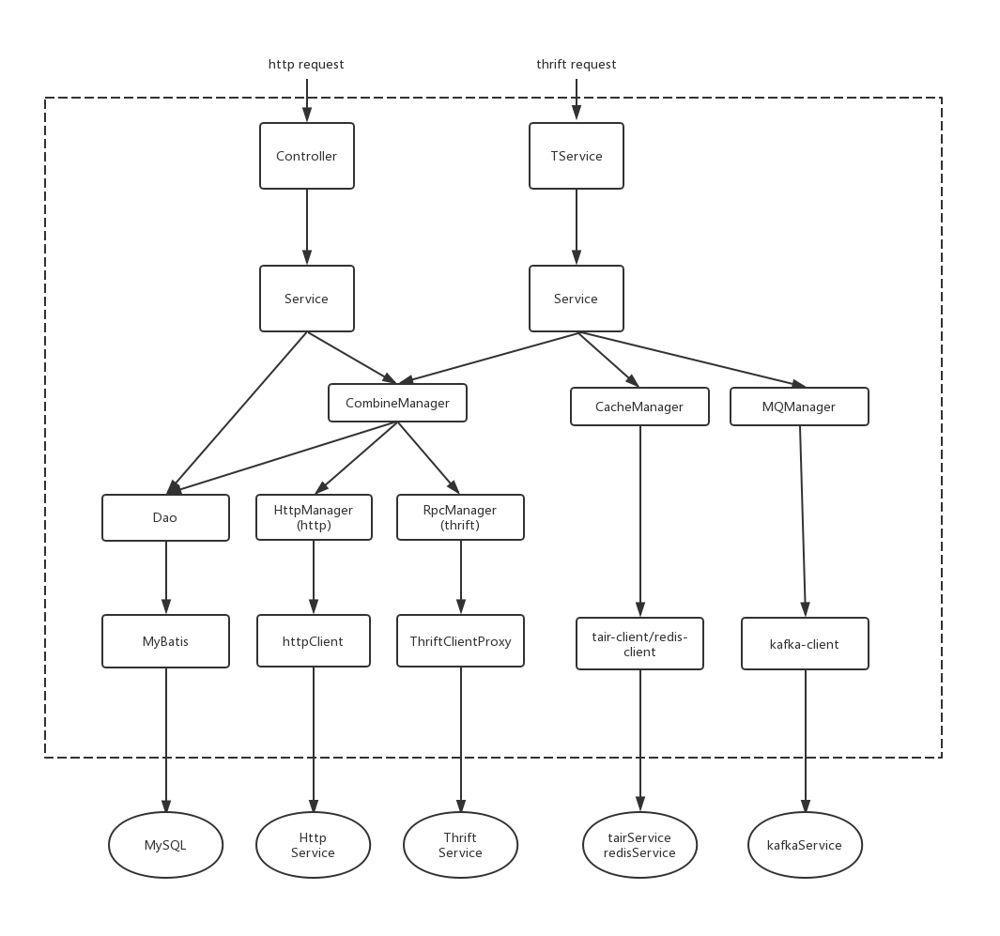
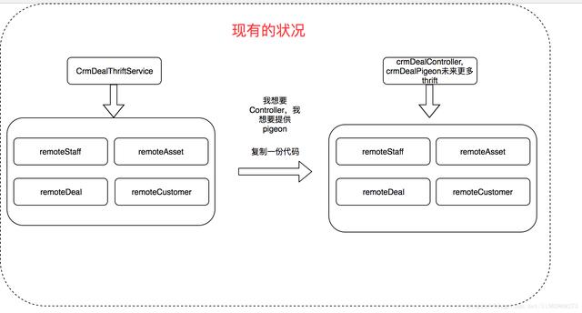
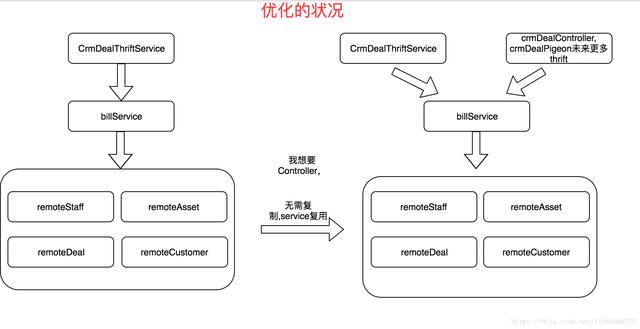

## 你的项目应该如何分层？

### 前言

大半年前在某脉上看到 一个蚂蚁金服大佬 发的这篇文章，前两天突然回想到，特此记录一下。

本文可以说是一篇转载文章（图是本人自己画的）。

### 目录

[1. 背景](#1-背景)

[2. 如何进行分层](#2-如何进行分层)

[3. 分层领域模型的转换](#3-分层领域模型的转换)

[4. 总结](#4-总结)

### 1. 背景

说起应用分层，大部分人都会认为这个不是很简单嘛 就 controller，service，mapper 三层。
看起来简单，很多人其实并没有把他们职责划分开，在很多代码中，controller 做的逻辑比 service 还多，service 往往当成透传了，
这其实是很多人开发代码都没有注意到的地方，反正功能也能用，至于放哪无所谓呗。
这样往往造成后面代码无法复用，层级关系混乱，对后续代码的维护非常麻烦。

的确在这些人眼中分层只是一个形式，前辈们的代码这么写的，其他项目代码这么写的，那么我也这么跟着写。
但是在真正的团队开发中每个人的习惯都不同，写出来的代码必然带着自己的标签，有的人习惯 controller 写大量的业务逻辑，
有的人习惯在service中之间调用远程服务，这样就导致了每个人的开发代码风格完全不同，后续其他人修改的时候，
一看，我靠这个人写的代码和我平常的习惯完全不同，修改的时候到底是按着自己以前的习惯改，还是跟着前辈们走，
这又是个艰难的选择，选择一旦有偏差，你的后辈又维护你的代码的时候，恐怕就要骂人了。

所以一个好的应用分层需要具备以下几点：

- 方便后续代码进行维护扩展
 
- 分层的效果需要让整个团队都接受
 
- 各个层职责边界清晰

### 2. 如何进行分层

#### 2.1 阿里规范

在阿里的编码规范中约束的分层如下：

- 开放接口层：可直接封装 Service 方法包括成 RPC 接口；通过 Web 封装成 HTTP 接口；进行 网关安全控制、流量控制等。

- 终端显示层：各个端的模板渲染并执行显示的层。当前主要是 velocity 渲染，JS 渲染，JSP 渲染，移动端展示等。

- Web 层：主要是对访问控制进行转发，各类基本参数校验，或者不复用的业务简单处理等。

- Service 层：相对具体的业务逻辑服务层。

- Manager 层：通用业务处理层，它有如下特征：
    1. 对第三方平台封装的层，预处理返回结果及转化异常信息；
    2. 对 Service 层 通用能力的下沉，如缓存方案、中间件通用处理；
    3. 与 DAO 层 交互，对多个 DAO 的组合复用。

- DAO 层：数据访问层，与底层 MySQL、Oracle、HBase 进行数据交互。

- 外部接口或第三方平台：包括其它部门 RPC 开放接口，基础平台，其它公司的 HTTP 接口。

- 阿里巴巴规约中的分层比较清晰简单明了，但是描述得还是过于简单了，
  以及 Service 层 和 Manager 层 有很多同学还是有点分不清楚之间的关系，
  就导致了很多项目中根本没有 Manager 层 的存在。下面介绍一下具体业务中应该如何实现分层

#### 2.2 优化分层

从我们的业务开发中总结了一个较为的理想模型，
这里要先说明一下由于我们的 rpc框架 选用的是 thrift 可能会比其他的一些 Rpc框架 例如 Dubbo 会多出一层，
作用和 controller 层 类似 

1. 最上层 Controller 和 TService 是阿里分层规范里面的第一层：轻业务逻辑，参数校验，异常兜底。
通常这种接口可以轻易更换接口类型,所以业务逻辑必须要轻，甚至不做具体逻辑。

2. Service：
业务层，复用性较低，这里推荐每一个 Controller 方法都得对应一个 Service，
不要把业务编排放在 Controller 中去做，为什么呢？
如果我们把业务编排放在 Controller 层 去做的话，
如果以后我们要接入 thrift，我们这里又需要把业务编排在做一次，
这样会导致我们每接入一个入口层这个代码都得重新复制一份如下图所示: 

这样大量的重复工作必定会导致我们开发效率下降，所以我们需要把业务编排逻辑都得放进 Service 中去做: 

3.Manager：可复用逻辑层。这里的 Manager 可以是单个服务的，比如我们的 Cache，MQ 等等，
当然也可以是复合的，当你需要调用多个 Manager 的时候，这个可以合为一个 Manager，
比如逻辑上的连表查询等。如果是 httpManager 或 rpcManager 需要在这一层做一些数据转换

4.DAO：数据库访问层。主要负责“操作数据库的某张表，映射到某个 java对象”，
Dao 应该只允许自己的 Service 访问，其他 Service 要访问我的数据必须通过对应的 Service。

### 3. 分层领域模型的转换

在阿里巴巴编码规约中列举了下面几个领域模型规约：

- DO（Data Object）：此对象与数据库表结构一一对应，通过 DAO 层向上传输数据源对象。
- DTO（Data Transfer Object）：数据传输对象， Service 或 Manager 向外传输的对象。
- BO（Business Object）：业务对象，由 Service 层输出的封装业务逻辑的对象。
- AO（Application Object）：应用对象，在 Web 层 与 Service 层 之间抽象的复用对象模型，极为贴近展示层，复用度不高。
- VO（View Object） ：显示层对象，通常是 Web 向模板渲染引擎层传输的对象。
- Query ：数据查询对象，各层接收上层的查询请求。注意超过 2 个参数的查询封装，禁止使用 Map 类来传输。

|    层次    |   领域模型   |
|------------|-------------|
| Controller/TService  | VO/DTO |
| Service/Manager      | AO/BO |

每一个层基本都自己对应的领域模型，这样就导致了有些人过于追求每一层都是用自己的领域模型，
这样就导致了一个对象可能会出现 3次 甚至 4次 转换在一次请求中，当返回的时候同样也会出现 3-4次 转换，
这样有可能一次完整的请求-返回会出现很多次对象转换。如果在开发中真的按照这么来，恐怕就别写其他的了，
一天就光写这个重复无用的逻辑算了吧。
所以我们得采取一个折中的方案: 

1. 允许 Service/Manager 可以操作数据领域模型，对于这个层级来说，本来自己做的工作也是做的是业务逻辑处理和数据组装。

2. Controller/TService 层 的领域模型不允许传入 DAO 层，这样就不符合职责划分了。 

3. 同理，不允许DAO层的数据传入到 Controller/TService.

### 4. 总结

总的来说业务分层对于代码规范是比较重要，决定着以后的代码是否可复用，
是否职责清晰，边界清晰，所以搞清楚这一块也比较重要。
当然这种分层其实见仁见智，团队中的所有人的分层习惯也不同，所以很难权衡出一个标准的准则，
总的来说只要满足职责逻辑清晰，后续维护容易，就是好的分层。

### 感谢

[多研究些架构，少谈些框架（4）-- 架构师是技术的使用者而不是信徒](https://github.com/JoeCao/JoeCao.github.io/issues/6)

[你的项目应该如何分层？](https://maimai.cn/article/detail?fid=1163981324&efid=pKbwc4vk_CiJIy0sRr1UBQ)
