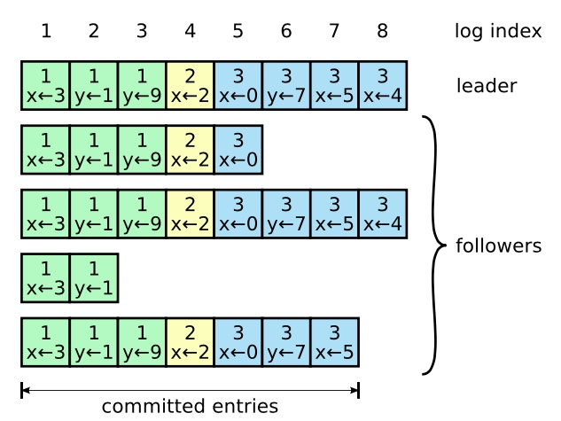

## Raft 日志复制

### 目录

[1. 日志结构](#1-日志结构)

[2. 主从日志的一致性](#2-主从日志的一致性)

[3. 日志特性](#3-日志特性)

[4. 领导人一致性检查](#4-领导人一致性检查)

[5. 总结](#5-总结)

### 1. 日志结构

**附加日志 RPC**：

由领导人负责调用来复制日志指令；也会用作 heartbeat

| 参数 | 解释 |
|----|----|
|term| 领导人的任期号|
|leaderId| 领导人的 Id，以便于跟随者重定向请求|
|prevLogIndex|新的日志条目紧随之前的索引值|
|prevLogTerm|prevLogIndex 条目的任期号|
|entries[]|准备存储的日志条目（表示心跳时为空；一次性发送多个是为了提高效率）|
|leaderCommit|领导人已经提交的日志的索引值|

| 返回值| 解释|
|---|---|
|term|当前的任期号，用于领导人去更新自己|
|success|跟随者包含了匹配上 prevLogIndex 和 prevLogTerm 的日志时为真|

接收者实现：

1. 如果 `term < currentTerm` 就返回 false
2. 如果日志在 prevLogIndex 位置处的日志条目的任期号和 prevLogTerm 不匹配，则返回 false 
3. 如果已经存在的日志条目和新的产生冲突（索引值相同但是任期号不同），删除这一条和之后所有的 
4. 附加日志中尚未存在的任何新条目
5. 如果 `leaderCommit > commitIndex`，令 commitIndex 等于 leaderCommit 和 新日志条目索引值中较小的一个

### 2. 主从日志的一致性

> 图 1 ：日志由有序序号标记的条目组成。
每个条目都包含创建时的任期号（图中框中的数字），和一个状态机需要执行的指令。
一个条目当可以安全的被应用到状态机中去的时候，就认为是可以提交了。

**Raft 为了保证主从日志的一致性，有以下保证**：

1. 领导人 来决定什么时候把日志条目应用到状态机中是安全的；这种日志条目被称为已提交。
Raft 算法保证所有已提交的日志条目都是持久化的并且最终会被所有可用的状态机执行。 

2. 领导人 把指令作为一条新的日志添加到日志中后（此时还未 committed，即未应用到至 复制状态机），将并行的发送 **附加日志 RPC** 给 跟随者，希望他们复制这条日志。

3. 当 领导人 收到大多数 追随者 返回正确响应，将会更新本地最大的且即将被提交的日志条目的索引

4. 领导人 会追踪发送 3中提到的索引，并且这个索引会被包含在未来的所有附加日志 **附加日志 RPC** 请求中，这样就能保证其他的服务器知道 领导人 的索引提交位置。

5. 追随者 知道一条日志已经被提交，那么他也会将这条日志应用到自己的状态机中（按照日志索引的顺序）。 

### 3. 日志特性

- 如果在不同的日志中的两个条目拥有相同的 索引 和 任期号，那么他们存储了相同的指令。（[Raft 在任何时候都保证的特性 —— 状态机安全特性](https://github.com/hackfengJam/blog/blob/master/tech/distributed/raft/raft_consensus_algorithm.md#3-Raft-%E5%9C%A8%E4%BB%BB%E4%BD%95%E6%97%B6%E5%80%99%E9%83%BD%E4%BF%9D%E8%AF%81%E4%BB%A5%E4%B8%8B%E7%9A%84%E5%90%84%E4%B8%AA%E7%89%B9%E6%80%A7)）

- 如果在不同的日志中的两个条目拥有相同的 索引 和 任期号，那么他们之前的所有日志条目也全部相同。（[领导人一致性检查](#4-领导人一致性检查)）

### 4. 领导人一致性检查

> 图 2：当一个领导人成功当选时，跟随者可能是任何情况（a-f）。
每一个盒子表示是一个日志条目；里面的数字表示任期号。
跟随者可能会缺少一些日志条目（a-b），可能会有一些未被提交的日志条目（c-d），或者两种情况都存在（e-f）。
例如，场景 f 可能会这样发生，某服务器在任期 2 的时候是领导人，已附加了一些日志条目到自己的日志中，但在提交之前就崩溃了；
很快这个机器就被重启了，在任期 3 重新被选为领导人，并且又增加了一些日志条目到自己的日志中；
在任期 2 和任期 3 的日志被提交之前，这个服务器又宕机了，并且在接下来的几个任期里一直处于宕机状态。

在每个服务器会保存以下状态

| 状态 | 在领导人里经常改变的 （选举后重新初始化）|
|----|--------|
| nextIndex[] | 对于每一个服务器，需要发送给他的下一个日志条目的索引值（初始化为领导人最后索引值加一）|
| matchIndex[] | 对于每一个服务器，已经复制给他的日志的最高索引值|

对于领导人：

*  一旦成为领导人：发送空的附加日志 RPC（心跳）给其他所有的服务器；在一定的空余时间之后不停的重复发送，以阻止跟随者超时
*  如果接收到来自客户端的请求：附加条目到本地日志中，在条目被应用到状态机后响应客户端
*  如果对于一个跟随者，最后日志条目的索引值大于等于 nextIndex，那么：发送从 nextIndex 开始的所有日志条目：
	* 如果成功：更新相应跟随者的 nextIndex 和 matchIndex
	* 如果因为日志不一致而失败，减少 nextIndex 重试
* 如果存在一个满足`N > commitIndex`的 N，并且大多数的`matchIndex[i] ≥ N`成立，并且`log[N].term == currentTerm`成立，那么令 commitIndex 等于这个 N

### 5. 总结

- 保证复制日志相同是一致性算法的主要工作也是其核心

- 日志特性  
  - 如果在不同的日志中的两个条目拥有相同的 索引 和 任期号，那么他们存储了相同的指令  
  - 如果在不同的日志中的两个条目拥有相同的 索引 和 任期号，那么他们之前的所有日志条目也全部相同  
  
- 状态机安全特性：如果一个领导人已经在给定的索引值位置的日志条目应用到状态机中，那么其他任何的服务器在这个索引位置不会提交一个不同的日志

- 领导人的一致性检查

### 相关博文

- [Raft 一致性算法](/tech/distributed/raft/raft_consensus_algorithm.md)

- [Raft 领导选举](/tech/distributed/raft/raft_leader_election.md)

- [Golang 操作 etcd（上）](/tech/distributed/etcd/etcd_usage_golang_1.md)

- [Golang 操作 etcd（下）](/tech/distributed/etcd/etcd_usage_golang_2.md)

#### 感谢

- [Raft 英文 paper pdf](https://ramcloud.atlassian.net/wiki/download/attachments/6586375/raft.pdf)

- [Raft 作者讲解视频](https://www.youtube.com/watch?v=YbZ3zDzDnrw&feature=youtu.be)

- [Raft 作者讲解视频对应的 PPT](https://ramcloud.atlassian.net/wiki/download/attachments/6586375/raft.pdf)

- [Raft 论文译文](https://github.com/maemual/raft-zh_cn/blob/master/raft-zh_cn.md)

- [Raft 动画](http://thesecretlivesofdata.com/raft/)

